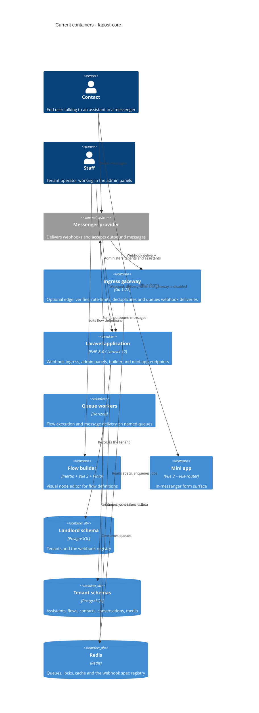

# Architecture map — fapost-core

> The **current** architecture (what exists today), produced by `survey` and read by
> specify / design / data-model / implement. Refresh with `survey` when the repo drifts past
> `reflects_commit`. This is generated; the authored `docs/platform/current-state.md` is
> reconciled at the bottom of this file, not replaced.

## Stack

- Language / runtime: PHP `^8.4` (`composer.json`), Go `1.27` for the ingress gateway (`gateway/go.mod:3`)
- Frameworks: Laravel `^12.0`, Filament admin panels, Horizon queue supervision, Inertia + Vue 3 front end, Vite build
- Build: `npm run build` → `vite build` (`package.json`); front-end type-check `npm run type-check`, front-end tests `npm test` → `vitest run`
- Test: `composer test` → `php artisan config:clear --ansi` then `php artisan test` (`composer.json`); architecture rules `composer run test:arch` → `vendor/bin/phpstan analyse --configuration phpstan.neon` (`composer.json`)
- Lint: `vendor/bin/pint --test` to report, `vendor/bin/pint --dirty` to fix (`Makefile:126`, `Makefile:129`)
- Gateway: `go vet ./...` and `go test ./...` (`.github/workflows/ci.yml:164`)

## C4 — system as it is

## Module inventory

| Module | Path | Layers | Wired at | Responsibility |
|---|---|---|---|---|
| Tenancy | `app/Domains/Tenancy` | contracts/infra/services/settings | `app/Providers/DomainServiceProvider.php:50` | Tenant context, schema switching, provisioning, webhook registry |
| Flow | `app/Domains/Flow` | domain/handlers/services/jobs | `app/Domains/Flow/Providers/FlowServiceProvider.php` | Flow engine, handler registry, sessions, state, validation |
| Messaging | `app/Domains/Messaging` | senders/adapters/routing | `app/Domains/Messaging/Providers/MessageSenderServiceProvider.php` | Outbound senders and the provider adapter layer |
| Webhook | `app/Domains/Webhook` | http/routes/dtos/deployment | `app/Domains/Webhook/Providers/WebhookServiceProvider.php` | Inbound webhook ingress, signature checks, queue handoff |
| Channels | `app/Domains/Channels` | contracts/services/models | `app/Domains/Channels/Providers/ChannelsServiceProvider.php` | Channel aggregates and registration |
| Contact | `app/Domains/Contact` | contracts/models/repositories/services/jobs/policies | `app/Domains/Contact/Providers/ContactServiceProvider.php:30` | Contacts, tags, groups, segments |
| Conversation | `app/Domains/Conversation` | models/services/ports | `app/Domains/Conversation/Providers/ConversationServiceProvider.php` | Dialogue transcript, operator inbox, takeover |
| Media | `app/Domains/Media` | models/services/ports | `app/Domains/Media/Providers/MediaServiceProvider.php` | Media storage, deduplication, channel asset cache |
| Assistant | `app/Domains/Assistant` | models/services/registry | `app/Providers/AssistantServiceProvider.php` | Assistant aggregate and its runtime registry |
| Staff | `app/Domains/Staff` | models/policies/jobs | `app/Providers/StaffServiceProvider.php` | Staff users, roles, staff notifications |
| Broadcasting | `app/Domains/Broadcasting` | models/jobs/services | no dedicated provider — jobs dispatched directly | Broadcasts, recipients, fan-out with backpressure |
| Presale | `app/Domains/Presale` | models/services | no dedicated provider | Pre-sale surface backing the public site |
| Shared | `app/Domains/Shared` | base classes/traits | consumed by other domains | Base model and shared model concerns |
| Foundation package | `packages/fapost-foundation` | contracts/dto/enums/lifecycle | `composer.json` require `fapost/foundation` | The public extension contract surface for solutions and plugins |
| Support package | `packages/fapost-support` | models/concerns/builder-schema | `composer.json` require `fapost/support` | Reusable primitives with no core dependency |
| Ingress gateway | `gateway` | cmd/internal | `webhook.ingress.driver` = `gateway` | Optional Go edge in front of webhook ingress |

## Conventions (cited — the rules a new feature must match)

- **Module wiring / registration:** providers listed explicitly in `bootstrap/providers.php`; seven domains own a provider under `app/Domains/{Domain}/Providers`, the rest are wired centrally — e.g. `app/Domains/Contact/Providers/ContactServiceProvider.php:30`
- **Worker-safety binding split:** request- and job-scoped state is `scoped`, stateless collaborators are `singleton` — `app/Providers/DomainServiceProvider.php:50` (scoped tenant context) versus `:76` (singleton registry writer)
- **Error handling:** one `final` exception class per file in the domain's `Exceptions/` folder, extending an SPL base — `app/Domains/Webhook/Exceptions/AdapterNotFoundException.php`
- **IDs:** ULID primary key stored in a `uuid` column, no database default — `packages/fapost-support/src/Concerns/HasUlidPrimaryKey.php`, migration side at `database/migrations/tenant/2026_04_02_100000_create_contacts_table.php:13`
- **Persistence / DB access:** named `tenant` and `landlord` connections (`config/database.php:104`, `config/database.php:117`); the tenant schema moves by swapping the connection's search path through a custom resolver — `app/Providers/DomainServiceProvider.php:45`, with switching and restore in `app/Domains/Tenancy/Services/TenantSwitcher.php:46`
- **Migrations:** Artisan migrations split by scope — `database/migrations/landlord/` is platform-wide and loaded explicitly at `app/Providers/AppServiceProvider.php:60`, `database/migrations/tenant/` runs per tenant schema; migrations may not reach into domain code, enforced by `tests/Architecture/MigrationTest.php`
- **Tests:** two PHPUnit suites, `Unit` and `Feature` (`phpunit.xml:8`), feature tests grouped per domain — `tests/Feature/Domains/Contact/ContactGroupTest.php`; architecture rules are PHPat classes under `tests/Architecture/` reached from `tests/Unit/Architecture/MigrationTest.php`, never by running that folder as a test suite
- **Inter-module communication:** domains hand work over through named queues rather than direct cross-domain calls — `app/Domains/Webhook/Http/WebhookController.php:87` (`flow.execution`); the other names in use are `messaging.transactional`, `messaging.broadcast`, `messaging.system` and `scheduled.triggers`
- **UI / styling:** three separately built front-end surfaces plus the Filament theme, declared as separate Vite inputs — `vite.config.ts:13`; detail in §Frontend / UI foundation below

## Datastores

| Store | Engine | Accessed via | Notes |
|---|---|---|---|
| Landlord schema | PostgreSQL | `DB::connection('landlord')`, only inside Tenancy infrastructure | `config/database.php:117`; holds tenants and the webhook registry — `app/Domains/Tenancy/Database/TenantDatabaseManager.php:35` |
| Tenant schemas | PostgreSQL | Default connection with the search path swapped per tenant | `config/database.php:104`; every domain model lives here |
| Redis | Redis | Queue, cache, lock and session backends; webhook spec registry | `.env.example` sets queue, cache and session to Redis; registry writer at `app/Domains/Tenancy/Services/WebhookRegistryWriter.php` |
| Test databases | SQLite in memory | PHPUnit environment | `phpunit.xml` sets both landlord and tenant to in-memory SQLite |

Note: `config/database.php:22`, `config/queue.php:18` and `config/cache.php:18` keep the framework's own fallbacks (SQLite and the database driver). The intended runtime comes from the environment — `.env.example` selects PostgreSQL and Redis.

## Frontend / UI foundation

- **Component library / design system:** none — no third-party Vue UI kit is installed (`package.json`); each surface hand-rolls its own components
- **Design tokens:** three independent sets, with no shared source — Tailwind v4 `@theme` at `resources/css/app.css:8` (indigo/orange brand palette), plain custom properties at `resources/css/builder.css:3`, and a third set at `resources/css/filament/theme.css:29`. The builder and the Filament theme define the *same* warm-neutral palette (identical text ramp `#1c1917 / #6b6560 / #a09b94`, sage accents) under different variable names — duplicated tokens, not two designs
- **Styling approach:** not unified. Tailwind is imported only by `resources/css/app.css`; the builder and the Filament theme are hand-written CSS driven by custom properties, and the mini app uses Tailwind utility classes
- **Shared primitives:** none across surfaces — `resources/js/shared/` holds only `resources/js/shared/http.ts`. Reusable pieces exist per surface: `resources/js/builder/components/` (dialogs, validation panel, node icon) and `resources/js/tma/components/fields/` (form field renderers)
- **State / data-fetching:** Inertia page resolution by glob, Pinia stores in the builder and the mini app, `vue-router` only in the mini app — `resources/js/builder/app.ts`, `resources/js/tma/app.ts`
- **Closest UI precedent:** a new builder panel looks like `resources/js/builder/components/editor/ConfigPanel.vue`; a new mini-app form field looks like `resources/js/tma/components/TmaFormRenderer.vue`; a new admin surface looks like `app/Providers/Filament/AdminPanelProvider.php`

## Where things live / closest precedents

- A new bounded context → `app/Domains/{Domain}/` with `Contracts`, `Models`, `Services`, `Providers`, modelled on `Contact` (`app/Domains/Contact/Providers/ContactServiceProvider.php:30`)
- A new asynchronous cross-domain effect → a job on one of the five named queues, modelled on `app/Domains/Contact/Jobs/SendContactNotificationJob.php`
- Anything that must run tenant-scoped inside a worker → `TenantSwitcher::runForTenant()` with the restore in `finally` (`app/Domains/Tenancy/Services/TenantSwitcher.php:46`)
- A new flow node → register a handler by `(type, version)`; its configuration UI needs no Vue file unless the schema-driven renderer is insufficient, in which case add a key to the override map in `resources/js/builder/components/editor/ConfigPanel.vue:26`
- A new extension contract for outside developers → `packages/fapost-foundation/src/Contracts/`, never in core

## Constraints & known tech-debt

- **No unified design system.** Three token sets and three styling approaches coexist, and no component is shared between surfaces. New cross-surface UI has nothing to compose against — it will either duplicate a fourth set or force a consolidation first.
- **The multi-tenant runtime is mandatory.** Core fails fast without a tenant context and there is no default-tenant fallback, so every install carries the tenancy machinery.
- **`HrSolutionServiceProvider` is an empty stub** registered in `bootstrap/providers.php`; it extends the framework's own provider, not the public `AbstractSolutionServiceProvider`. Building the first solution through the public contracts starts from zero, not from this file.
- **Concurrency is covered by mocks only.** No test suite runs against a live Redis; `phpunit.xml` pins the cache to an array store and the queue to sync.
- **Only one messenger adapter is real.** The WhatsApp adapter throws on every method, so channel swappability is a property of the contracts rather than a demonstrated fact.
- **Extension packages are consumed from version control** (`composer.json` requires `fapost/foundation` and `fapost/support` at `^0.2`); local work needs the symlink script `tools/dev-link-packages.php`, which runs after install and no-ops when `packages/` is absent.
- **Tests run inside a container in local development.** The repository commands above are canonical; the working environment wraps them, so a command that passes in the container may not run directly on the host.

## Reconciliation with the authored architecture doc

`docs/platform/current-state.md` is the authored reference and is **stale in one direction**: it lists the Conversation Logging domain, managed broadcast entities and contact segments under "What Does Not Exist Yet", while `app/Domains/Conversation/` and `app/Domains/Broadcasting/` exist with their own providers and jobs, and `docs/platform/ROADMAP.md` records the matching milestones as closed. Everything that document states about the stack, the tenant model and the partially-implemented areas still matches the code. This map reflects the code; the authored document is left untouched and should be corrected separately.

Two claims in it deserve a note rather than a correction: the RAG node still has no storage or provider behind it, and event fan-out after `emit_event` still resolves triggers rather than starting subscribed flows — both are confirmed by the roadmap and neither is contradicted by this scan.
