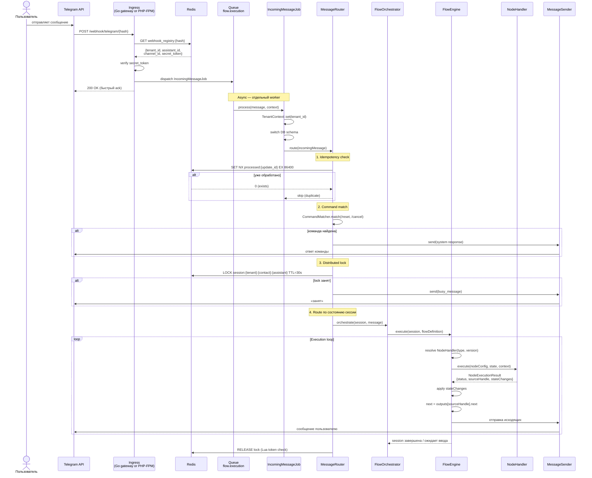

# Webhook Pipeline — входящее сообщение

Полный путь сообщения от Telegram до ответа бота.

## Ключевые классы

| Класс | Путь | Роль |
|-------|------|------|
| `WebhookController` | `Http/Controllers/Webhook/` | Быстрый ack, dispatch job |
| `IncomingMessageJob` | `Jobs/` | Tenant setup, вызов MessageRouter |
| `MessageRouter` | `Domains/Flow/Routing/` | 6-шаговый pipeline (⏳ Phase D) |
| `FlowOrchestrator` | `Domains/Flow/Services/` | Сессия + запуск engine |
| `FlowEngine` | `Domains/Flow/Services/` | Execution loop, handler registry |
| `MessageSender` | `Domains/Messaging/Services/` | Отправка через channel adapter |

## Важные инварианты

- **Ingress stateless** (ADR-01, отменён): без БД, только Redis и dispatch — поэтому его можно вынести за пределы PHP. Роль быстрого ingress выполняет опциональный Go-гейтвей (`gateway/`); без него те же запросы обслуживает PHP-FPM
- `public_hash` → Redis — landlord DB не участвует в hot path
- Lock не получен → **busy notice**, не дроп: job уходит в backoff очередь
- Optimistic lock: `flow_sessions.version` — `UPDATE WHERE version = N`

## Связано с
- [[architecture/adr/01-octane-ingress-only|ADR-01]] — отменён; ingress-only обоснование сохранено как история
- [[09-message-routing-concurrency|ADR-09 Message Routing]] — concurrency & lock
- [[architecture/platform/10-message-pipeline|Platform: Message Pipeline]]
- [[specs/flow-engine/README|Flow Engine спека]]
