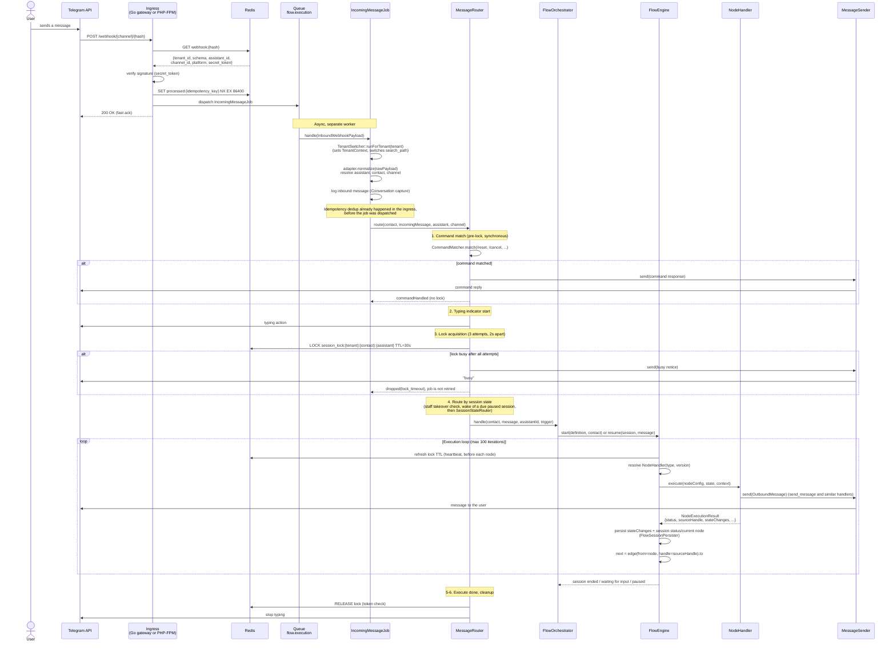

# Webhook Pipeline: an incoming message

The full path of a message from a channel (Telegram here) to the bot's reply.

## Key classes

| Class | Path | Role |
|-------|------|------|
| `WebhookController` | `app/Domains/Webhook/Http/WebhookController.php` | Stateless ack: registry lookup, signature check, idempotency, dispatch |
| `IncomingMessageJob` | `app/Domains/Webhook/Jobs/IncomingMessageJob.php` | Tenant switch, normalisation, contact resolution, calls `MessageRouter` |
| `MessageRouter` | `app/Domains/Flow/Routing/MessageRouter.php` | Pipeline: commands, typing, lock, state routing, execute, cleanup |
| `FlowOrchestrator` | `app/Domains/Flow/Orchestration/FlowOrchestrator.php` | Finds or starts the session, access policy, optimistic retry; calls the engine |
| `FlowEngine` | `app/Domains/Flow/Services/FlowEngine.php` | Execution loop; public API `start`, `resume`, `runSession` (also `resumeFromNode`, `resumeAfterSubflow`) |
| `MessageSender` | `app/Domains/Messaging/MessageSender.php` | Delivery through the channel adapter, called by handlers via `MessageSenderInterface` |

## Important invariants

- **The engine does not send messages.** `NodeExecutionResult` carries no outbound messages; handlers
  such as `send_message` send them during `execute()` through `MessageSenderInterface`.
- **The ingress is stateless:** no database, only Redis and a dispatch, which is why it can live
  outside PHP. The optional Go gateway (`gateway/`) is the fast ingress; without it the same requests
  are served by PHP-FPM (`WebhookController`). The controller touches no Eloquent and no
  `TenantContext`.
- The channel hash resolves through Redis (`webhook:{hash}`); on a miss the registry falls back to
  the landlord `webhook_registry` table and re-caches it.
- Webhook idempotency: `processed:{idempotency_key}` (`SET NX`, 24 h) in the ingress, before dispatch.
- The session lock is one per (tenant, contact, assistant) triple, key
  `session_lock:{tenant}:{contact}:{assistant}` (`LockScope::key()`), TTL 30 s.
- Lock not acquired after 3 attempts 2 s apart: **busy notice** plus `dropped(lock_timeout)`; the job
  is **not** retried. The job's backoff (1, 2, 5, 10 s) applies only when the router catches
  `engine_lock_timeout` (the lock was lost or could not be taken during execution, not at the first
  acquire).
- Optimistic lock: `flow_sessions.version`, `UPDATE ... WHERE version = N`; `FlowOrchestrator`
  retries a `FlowConcurrencyException` up to 3 times.

## Related

- `.ai/knowledge/domains/flow/OVERVIEW.md` and `.ai/knowledge/domains/channel-ingress/OVERVIEW.md`
- [02-flow-engine-loop.md](02-flow-engine-loop.md), [03-tenant-context.md](03-tenant-context.md)
