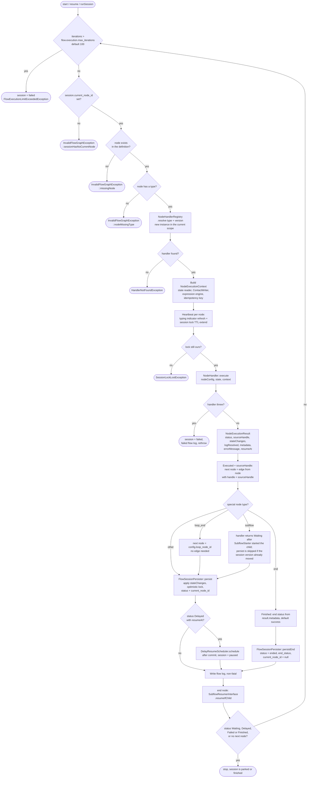

# Flow Engine: the execution loop

How the engine walks the node graph from start to the end (or to a pause for input).

The loop is `FlowEngine::executeLoop()` in `app/Domains/Flow/Services/FlowEngine.php`. It is entered
from the public API `start()`, `resume()`, `runSession()`, `resumeFromNode()` and
`resumeAfterSubflow()`.



## What the engine owns, what a handler owns

| Concern | Owner |
|---------|-------|
| Next node (edge lookup by `sourceHandle`) | Engine (`FlowGraphResolver::resolveNextNode`) |
| `loop_end` navigation back to its loop | Engine, via `config.loop_node_id` (denormalised at publish) |
| `end` status | Handler puts it in `metadata`; the persister applies it (`persistEnd`) |
| Sending messages | Handler, through `MessageSenderInterface` during `execute()`. The engine sends nothing and `NodeExecutionResult` has no messages |
| Contact mutations | Handler, through `ContactWriterInterface` |
| Session state / status / `current_node_id` | `FlowSessionPersister` |

## Status mapping (persister)

| `NodeExecutionStatus` | Session status |
|-----------------------|----------------|
| `Executed` with a next node | `active`, `current_node_id` = next node |
| `Executed` with no next node | `completed`, `current_node_id` = null |
| `Waiting` | `waiting_input` |
| `Delayed` with `resumeAt` | `paused` (plus `system.delayed.{nodeId}.resume_at`) |
| `Delayed` without `resumeAt` | `waiting_input` |
| `Failed` | `failed` |
| `Finished` (the `end` node) | `ended` with `end_status` |

## Failure modes

| Condition | Result |
|-----------|--------|
| Iteration budget exceeded (`config/flow.php`, `execution.max_iterations`, env `FLOW_MAX_ITERATIONS`, default 100) | session `failed`, `FlowExecutionLimitExceededException` |
| No current node / node not in the graph / node without type | `InvalidFlowGraphException::sessionHasNoCurrentNode()` / `missingNode()` / `nodeMissingType()` |
| No handler for `type@version` | `HandlerNotFoundException` |
| Handler throws | session `failed`, failed flow log, exception rethrown to the queue retry policy |
| Session lock lost mid-run | `SessionLockLostException`, the run is abandoned |
| Optimistic-lock conflict on save | `FlowConcurrencyException` (the orchestrator retries) |

## Optimistic lock

```
UPDATE flow_sessions
  SET state = ?, version = version + 1
  WHERE id = ? AND version = ?   -- no match -> OptimisticLockConflictException
```

## Handler contract

A handler **does not know** about the graph, only its own config and state:

```php
interface NodeHandlerInterface {
    public function execute(
        array $nodeConfig,
        array $state,
        NodeExecutionContext $context
    ): NodeExecutionResult;
}
```

It returns a `sourceHandle` (the output name), not a `nextNodeId`. The engine resolves the next node.

## Related

- [04-session-state-machine.md](04-session-state-machine.md)
- [06-subflow-lifecycle.md](06-subflow-lifecycle.md)
- `.ai/knowledge/domains/flow/OVERVIEW.md`
