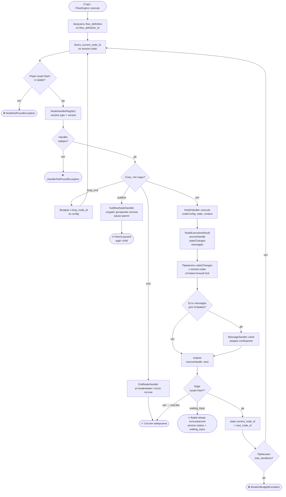

# Flow Engine — цикл выполнения

Как engine проходит граф нод от старта до конца (или паузы на ввод).



## Спец. случаи engine (graph-aware навигация)

Engine делает special-case для трёх типов нод — handler остаётся graph-unaware:

| Тип | Поведение engine |
|-----|-----------------|
| `end` | Устанавливает `session.status` по `end_status` config |
| `loop_end` | Переходит к `loop_node_id` (денормализован при publish) |
| `subflow` | Создаёт дочернюю сессию, ставит parent в `paused_subflow` |

## Оптимистичный lock

```
UPDATE flow_sessions
  SET state = ?, version = version + 1
  WHERE id = ? AND version = ?  ← если не совпадает → retry
```

## Handler contract

Handler **не знает** о графе — только о своей конфигурации и state:

```php
interface NodeHandlerInterface {
    public function execute(
        array $nodeConfig,
        array $state,
        NodeExecutionContext $context
    ): NodeExecutionResult;
}
```

Возвращает `sourceHandle` (имя выхода), не `nextNodeId`. Engine сам резолвит следующую ноду.

## Связано с
- [[specs/flow-engine/README|Flow Engine спека]]
- [[specs/flow-engine/00-overview|00 State model]]
- [[10-state-writer-semantics|ADR-10 State Writer]]
- [[04-session-state-machine]]
