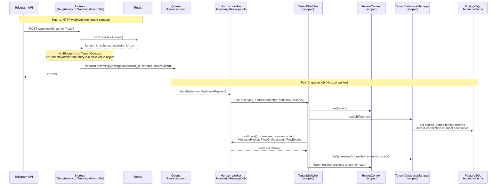

# Tenant Context: setting the context and switching the schema

Tenant context is established in the **worker**, not at the ingress. The webhook ingress resolves the
channel from Redis and dispatches a job; the queue job switches the tenant.

## Key classes

| Class | Path | Role |
|-------|------|------|
| `TenantContextInterface` / `TenantContext` | `app/Domains/Tenancy/Contracts/`, `app/Domains/Tenancy/Services/TenantContext.php` | Holds the current tenant; `get()` throws `TenantNotResolvedException` when unset |
| `TenantSwitcher` | `app/Domains/Tenancy/Services/TenantSwitcher.php` | `runForTenant(tenant, callback)` with a `finally` restore; nested calls restore the outer tenant; also resets cached permissions and runs restore hooks (for example `CurrentAssistant`) |
| `TenantDatabaseManager` | `app/Domains/Tenancy/Database/TenantDatabaseManager.php` | `switchTo()` / `restore()`: pushes the previous connection on a stack, sets the tenant connection's PostgreSQL `search_path` to the tenant schema |
| `TenantPostgresConnection` | `app/Domains/Tenancy/Database/TenantPostgresConnection.php` | pgsql connection class that lets `search_path` move while the connection stays open (no dropped transaction) |
| `IncomingMessageJob` | `app/Domains/Webhook/Jobs/IncomingMessageJob.php` | Wraps all domain work in `TenantSwitcher::runForTenant()` |

## Important invariants

- **Scoped, not singleton:** `TenantContextInterface`, `TenantDatabaseManagerInterface` and
  `TenantSwitcher` are registered with `scoped()` in `DomainServiceProvider`, so a Horizon job gets
  a fresh instance and the scope is flushed between jobs. Nothing tenant-specific may live in a
  singleton or in static state (see the worker-safety convention).
- **Restore is mandatory:** one Horizon worker runs many jobs in a row; a tenant left set would leak
  into the next job. `runForTenant()` always restores in `finally`, even when the callback throws or
  the restore itself fails.
- **Hard fail without context:** `TenantContext::get()` throws when no tenant is set. There is no
  fallback to a default tenant on the worker path.
- **The landlord database is not on the webhook hot path:** the channel resolves from Redis by
  `hash`; only a Redis miss falls back to the landlord `webhook_registry` table (through the Tenancy
  domain's reader).
- The webhook controller never switches the tenant. Schema switching happens only inside jobs,
  console commands and HTTP requests that go through the tenancy middleware.

## Related

- [01-webhook-pipeline.md](01-webhook-pipeline.md)
- `.ai/knowledge/domains/tenancy/OVERVIEW.md`, `.ai/knowledge/domains/tenancy/RULES.md`
- `.ai/knowledge/conventions/worker-safety.md`
