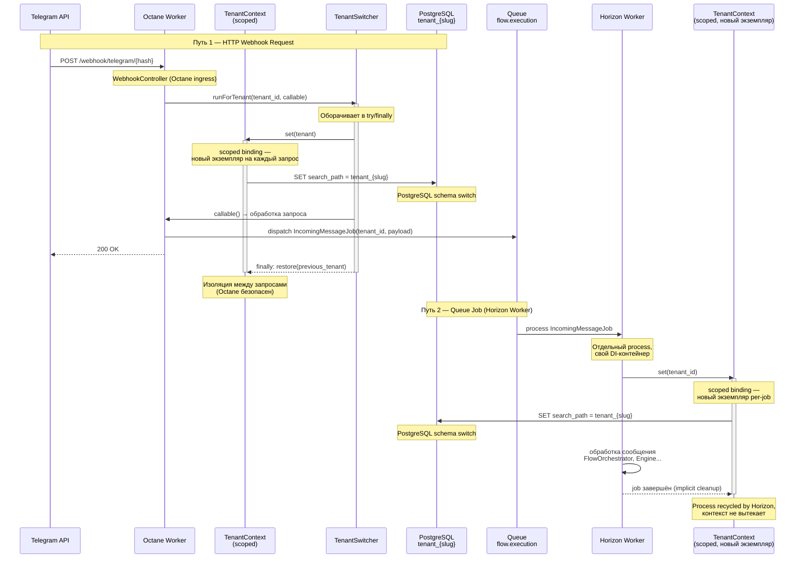

# Tenant Context — установка контекста и переключение схемы

Два пути инициализации tenant-контекста: HTTP webhook запрос (через Octane) и Queue Job (через Horizon worker).

## Ключевые классы

| Класс | Путь | Роль |
|-------|------|------|
| `TenantContextInterface` | `Domains/Tenancy/Contracts/` | Scoped binding — хранит текущий tenant per-request/job |
| `TenantSwitcher` | `Domains/Tenancy/Services/` | `runForTenant(callable)` с `finally restore()` — Octane-safe |
| `TenantDatabaseManager` | `Domains/Tenancy/Services/` | Переключение PostgreSQL search_path на schema tenant |
| `IncomingMessageJob` | `Jobs/` | `TenantContext::set()` в начале handle(), перед любой бизнес-логикой |

## Важные инварианты

- **Scoped, не Singleton:** `TenantContext` зарегистрирован как `scoped` — новый экземпляр на каждый HTTP-запрос и Job, нет state leakage
- **Octane только для webhook** (ADR-01): `/webhook/*` → Octane + `TenantSwitcher::runForTenant()`, всё остальное → PHP-FPM
- **Hard fail без контекста:** `TenantContext::get()` бросает исключение если tenant не установлен — никаких fallback к default tenant
- **Landlord DB не в hot path:** tenant резолвится из Redis по `public_hash`, `landlord` БД не участвует при обработке webhook

## Связано с
- [[01-octane-ingress-only|ADR-01 Octane]] — TenantSwitcher в Octane
- [[architecture/platform/01-overview-layers|Platform: Overview]]
- [[01-webhook-pipeline]]
- [[01-overview-layers]] — архитектура платформы
- [[08-concurrency-idempotency]] — concurrency
- [[diagrams/01-webhook-pipeline]] — диаграмма webhook pipeline
