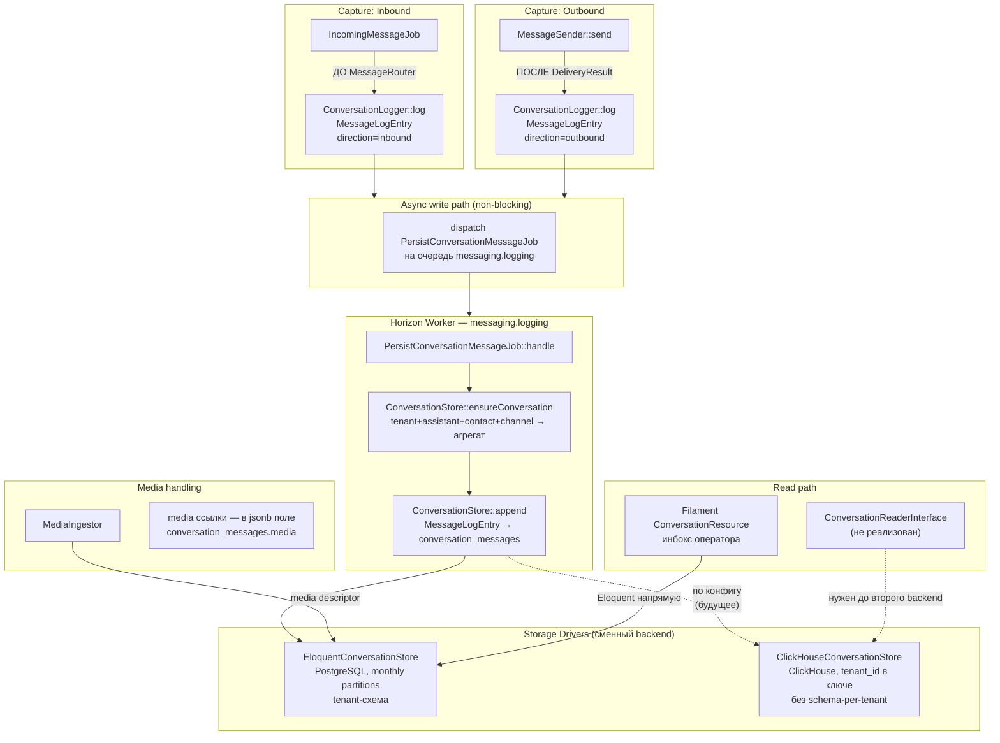

# Conversation Logging — pipeline хранения диалогов

**Статус: реализовано.** Асинхронный pipeline логирования входящих и исходящих сообщений через сменный
backend-драйвер, домен `app/Domains/Conversation/`. Актуальное описание домена —
[`.ai/knowledge/domains/conversation/OVERVIEW.md`](/.ai/knowledge/domains/conversation/OVERVIEW.md).

Два известных расхождения с диаграммой/спекой ниже (зафиксированы как trade-off, не как баг):

- `ConversationReaderInterface` не реализован — read-порта нет. Filament-инбокс
  (`app/Filament/Assistant/Resources/Conversations`) читает Eloquent-модели `Conversation` /
  `ConversationMessage` напрямую.
- Дедуп-индекс `conversation_messages_idem_unique` включает `created_at` как колонку partition-key
  (Postgres требует это для уникального индекса на партиционированной таблице):
  `(conversation_id, direction, idempotency_key, created_at)`.

## Архитектурные порты

| Интерфейс | Кто использует | Что делает |
|-----------|---------------|-----------|
| `ConversationLoggerInterface` | Capture-сайты: `IncomingMessageJob`, `MessageSender` | Write-порт: принимает `MessageLogEntry`, **fire-and-forget** |
| `ConversationStoreInterface` | `PersistConversationMessageJob` | Backend-порт: `ensureConversation()`, `append()`, `updateStatus()` |
| `ConversationReaderInterface` | — | **Не реализован.** Задуманный read-порт (`list()`, `get()`, `findConversation()`); инбокс читает Eloquent-модели напрямую |

## Важные инварианты

- **Non-blocking capture:** `ConversationLogger::log()` только диспатчит job — никогда не блокирует hot path
- **Чтение идёт через Eloquent:** read-порта нет, `ConversationResource` читает `Conversation` / `ConversationMessage` напрямую. Порт записи сменный, порт чтения — нет: второй backend (ClickHouse) потребует сначала read-порт
- **Capture-порядок:** inbound логируется ДО `MessageRouter`, outbound — ПОСЛЕ получения `DeliveryResult` (успех/провал фиксируется)
- **Один тред = Conversation:** агрегат по ключу `(tenant_id, assistant_id, contact_id, channel_id)` создаётся один раз, сообщения добавляются в него
- **ClickHouse-ready:** PostgreSQL driver — дефолт, ClickHouse добавляется сменой binding без изменения capture-кода
- Очередь `messaging.logging` изолирована от `messaging.transactional` — медленный logging worker не влияет на ответы бота

## Связано с
- [[specs/messaging/conversation-logging|Спека Conversation Logging]]
- [[09-message-routing-concurrency|ADR-09]] — capture site: IncomingMessageJob
- [[01-webhook-pipeline]] — место захвата inbound
- [[11-logging-retention]] — logging и retention
- [[ROADMAP]] — дорожная карта платформы
