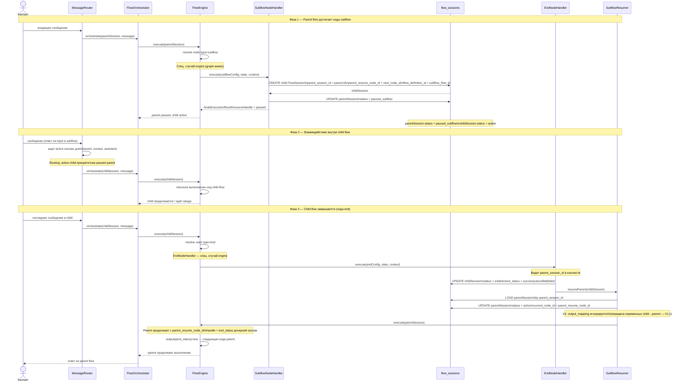

# Subflow Lifecycle — запуск вложенного flow и возврат управления

Полный цикл выполнения subflow-ноды: от запроса контакта до resumed parent, включая routing входящих сообщений в дочернюю сессию.

## Ключевые классы

| Класс | Путь | Роль |
|-------|------|------|
| `SubflowNodeHandler` | `Domains/Flow/Handlers/` | Создаёт child сессию, ставит parent в `paused_subflow` |
| `EndNodeHandler` | `Domains/Flow/Handlers/` | При наличии `parent_session_id` — триггерит resume parent |
| `SubflowResumer` / `DefaultSubflowResumer` | `Domains/Flow/Services/` | Загружает parent, обновляет статус, перезапускает engine |
| `FlowEngine` | `Domains/Flow/Services/` | Special-case по типу `subflow` и `end` (graph-aware навигация) |
| `CallGraphValidator` | `Domains/Flow/Services/` | Валидирует глубину вложенности при publish (max 3 уровня) |

## Важные инварианты

- **Routing приоритет:** пока child сессия active — все сообщения от контакта роутятся в child, не в parent
- **flow_definition_id snapshot:** child сессия стартует с `flow_definition_id` subflow — снимок зафиксирован, не меняется
- **`parent_resume_node_id`** денормализуется в child при создании — parent знает куда вернуться без lookup в граф
- **Глубина вложенности:** максимум 3 уровня (`A → B → C → D` запрещено), проверяется `CallGraphValidator` при publish, не в runtime
- **V1 — output_mapping не реализован:** переменные из child state в parent не передаются автоматически; реализуется в V1.1
- **`end_status` → handle:** parent resume использует `end_status` дочерней сессии как имя выхода (`success` / `cancelled` / `failed`) для резолвинга следующей ноды

## Связано с
- [[11-subflow-composition|ADR-11 Subflow Composition]]
- [[specs/flow-engine/nodes/08-subflow|Нода subflow]]
- [[04-session-state-machine]] — paused_subflow статус
- [[02-flow-engine-loop]] — engine-level навигация
- [[diagrams/02-flow-engine-loop]] — диаграмма execution loop
