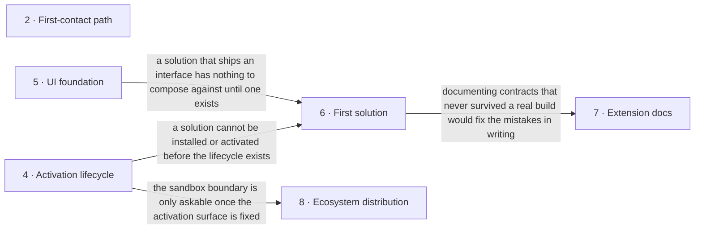

# Roadmap — fapost-core

> **A decomposition, not a promise.** The overall idea broken into incremental steps: what each
> step is, where it comes from, how big it is — or that nobody has looked at it yet — and in which
> order, and parallel lanes, we walk them. **No dates** (except shipped history), **no scores** —
> order is the prioritization. The *solution* for any step is designed in the task that takes it on,
> not here.

> **Scope split.** This file is the product decomposition of [`idea-brief.md`](./idea-brief.md): it
> says which steps exist and in which order, and — in Engineering backlog — which owed work runs
> beside them. Every open spec under `.ai/specs/` appears here exactly once. Each step's own plan — phases, decisions, open
> questions — lives in its spec under `.ai/specs/`, and what was already built is recorded in
> [`platform/ROADMAP.md`](./platform/ROADMAP.md) and [`platform/TASKS.md`](./platform/TASKS.md).
> Zones below are verified against [`ARCHITECTURE.md`](../.ai/knowledge/ARCHITECTURE.md).

## Destination

A developer inside the Laravel ecosystem can stand up FaPost, extend it through the public contracts without the author's help, and deliver a client's conversational assistant faster than on the system FaPost replaces.

## Steps

| # | Step | Source | Size | Where it is tracked |
|---|---|---|:---:|---|
| 2 | First-contact path — installation, a seeded demo assistant and self-hosting docs, with a named target time from install to a working assistant | idea-brief.md §6 Risks | M | spec `.ai/specs/first-contact-path/` |
| 4 | Solution activation lifecycle — manifest validation, activation storage and registry, the activation screen, and the lifecycle tests that prove install → activate → handler available | idea-brief.md §7 Recommendation | M | spec `.ai/specs/solution-activation-lifecycle/` |
| 5 | UI foundation for extenders — one token source shared by the operator-facing surfaces and the small set of primitives an extension actually composes against | idea-brief.md §6 Risks | M | spec `.ai/specs/ui-foundation/` |
| 6 | First solution built through the public contracts only — no privileged access into the core, as an outsider would build it | idea-brief.md §7 Recommendation | L | spec `.ai/specs/first-solution/` |
| 7 | Extension documentation for outsiders — the Extending section rewritten against contracts that survived a real build | idea-brief.md §3 Users | M | spec `.ai/specs/extension-docs/` |
| 8 | Ecosystem distribution → see [Not yet specified](#not-yet-specified) | idea-brief.md §7 Recommendation | fog | spec `.ai/specs/ecosystem-distribution/` |

Step progress is read from the specs themselves: `.ai/scripts/jig spec list`. Nothing tracks status here.

## Engineering backlog

Work outside the product order: it does not test the bet in the brief, but it is owed — limits the
V1 design deferred, retention the code does not enforce, read-side views over data already
collected. It runs in the gaps between product steps, never ahead of them, and in this order.

| # | Direction | Why it is owed | Size | Where it is tracked |
|---|---|---|:---:|---|
| B1 | Data lifecycle — retention for transcripts, session history and flow versions; erasure of a contact's transcript; a transcript read port | Tables grow without bound on a self-hosted install, and deleting a contact leaves its messages behind (the partitioned message table has no foreign keys) | M | spec `.ai/specs/data-lifecycle/` |
| B2 | Flow engine V1.x — loop checks and budget, safe `call` retries, subflow parameters, per-tenant expression engine, node capabilities | Limits the V1 node design named as "later"; none needs a breaking change | L | spec `.ai/specs/flow-engine-v1x/` |
| B3 | Operator insights — broadcast report, flow analytics, live inbox | The data is recorded and nobody can read it in the panel | M | spec `.ai/specs/operator-insights/` |
| B4 | Builder versioning and content — rollback, compare, preview, content keys | A bad publish has no undo in the builder | M | spec `.ai/specs/builder-versioning/` |
| B5 | RAG knowledge bases — provider and storage decision, then a real adapter | `rag_query` is in the palette and always fails at its runtime guard | M | spec `.ai/specs/rag-knowledge-bases/` |

Defects found while reconciling the documentation with the code (2026-10-05), filed as Jig tasks and
taken whenever a lane is free: `fix-create-assistant-guard` (the create page requires an admin while
the policy allows `ManageAssistants`), `translations-assistant-scope` (translation pages do not check
the assigned assistant), `remove-dead-transactional-job` (`messaging.transactional` has no producer),
`fix-migration-rule-reason` (a PHPat rule cites a section of `CLAUDE.md` that no longer exists),
`wire-flow-definition-validator` (the structural graph validator is registered but never called),
`subflow-child-routing` (the `paused_subflow` routing branch is unreachable and
`parent_resume_node_id` is never read).

## Not yet specified

| Area | What we'd have to learn | Blocks | How it gets sharpened |
|---|---|:---:|---|
| Ecosystem distribution — how a third-party extension reaches another installation and what it is allowed to do once there | What an extension may do at runtime, where the sandbox boundary sits, whether distribution rides on the existing package channel or needs its own, and what a paid closed extension needs in order to be installable at all | 8 | A recon pass once the first solution has been built through the public contracts, since that build is what reveals which contracts an outsider actually touches |

## Out of scope

- **Staff activity log** — no section of the brief justifies it; its stated purpose is selling to tenants with several staff, and earning money is explicitly not this stage's goal. Detail is kept in the spec `.ai/specs/audit-log/`, outside the product order.
- **Model-integration server surface** — no section of the brief justifies it; it closes none of the three positioning pillars. Detail is kept in the spec `.ai/specs/mcp-server/`, outside the product order.
- **Web forms data collection** — a product feature with no anchor in the brief; it neither tests extensibility nor shortens the first-contact path. Detail is kept in the spec `.ai/specs/forms-data-collection/`, outside the product order.
- **Multi-tenant shell and billing** — the owner's separate closed product, not part of the open distribution (idea-brief.md §5 Out of scope).
- **Additional messenger channels** — channel swappability is architectural, but no further channel is promised to a date; they follow demand (idea-brief.md §5 Out of scope).
- **Monetising the core** — not a goal of this stage; the goal is core quality and ease of extension (idea-brief.md §5 Out of scope).

## Open decisions

| # | Question | Type | Owner | Blocks |
|---|---|:---:|:---:|:---:|
| D2 | What is the target time from a fresh installation to a first working assistant, as a number we are willing to be measured against | grilling | human | 2 |
| D3 | How does "not earning money right now" reconcile with a shell, billing and a marketplace remaining in the plans — which of the two signals leads | grilling | human | 8 |
| D4 | Does an installed solution have to be rebuilt into the front-end bundle before its overrides appear, and is there a path that avoids it | research | agent | 4 |
| D5 | Does the public site keep its own brand palette, or does one token source cover every surface including it | grilling | human | 5 |

## Decisions so far

- **D1** — the permissive licence carries the first sentence of the project description and the landing page; conversation as a first-class object and the native stack follow it, in that order → `README.md`, [`site/index.mdx`](./site/index.mdx)
- The product decomposition lives here; engineering milestones and their history stay separate → [`platform/ROADMAP.md`](./platform/ROADMAP.md)
- Positioning is a framework for developers in the Laravel ecosystem, built on three pillars, not another open bot constructor → [`idea-brief.md §7 Recommendation`](./idea-brief.md)
- Multi-tenancy is closed automatically by the bounded context; the open distribution installs single-tenant and the multi-tenant shell stays a separate closed product → [`idea-brief.md §5 Out of scope`](./idea-brief.md)
- The extension contracts live in their own repositories, absent from this working tree and symlinked in for local development → [`ARCHITECTURE.md`](../.ai/knowledge/ARCHITECTURE.md)
- The extension surface is partly built already: the action handler registry and the builder component publish contract exist, activation and manifest validation do not → [`ARCHITECTURE.md`](../.ai/knowledge/ARCHITECTURE.md)
- The bet is tested on the owner's own client rollouts carried out through the public contracts, not on a showcase for buyers → [`idea-brief.md §7 Recommendation`](./idea-brief.md)

## Dependency graph

## Execution path

| Wave | Steps | Zone per step (why parallel-safe) | Unlocks |
|:---:|---|---|---|
| 1 | 2 ∥ B1 | 2: `docs/site/self-hosting/` + demo seeder · B1: `app/Domains/Conversation` + flow console commands (disjoint) | — |
| 2 | 4 ∥ 5 | 4: `app/Domains/Tenancy` + `app/Filament` · 5: `resources/css` + `resources/js/shared` (disjoint) | 6 |
| 3 | 6 | 6: `(new)` solution package repository | 7 |
| 4 | 7 | 7: `docs/site/extending/` | — |

The backlog lane runs beside the product waves, one direction at a time in the order B1 → B5; a
backlog item never holds up a product step, and B2's Solution-registered commands wait for step 4.
The defect tasks need no wave — each is one small pull request.

Contract edits that step 4 or step 6 turn out to need happen in the foundation package's own repository, which is `(new)` ground from this working tree's point of view — it is absent here and symlinked in for local development, so it can never conflict with a lane in this repo.

## Shipped

| Step | Shipped | Link |
|---|---|---|
| 3 · Positioning rewrite | 2026-09-23 | Project description and landing rebuilt on the three pillars — task `positioning-rewrite`. |
| 1 · Ship the replacement | 2026-09-22 | Every production-readiness criterion closed, the concurrency suite running against real Redis and a load test of 100 concurrent sessions with no state leakage — [`platform/ROADMAP.md`](./platform/ROADMAP.md) § Критерии «Production Ready». Rolling the platform out to real clients is operational work and carries no spec. |
