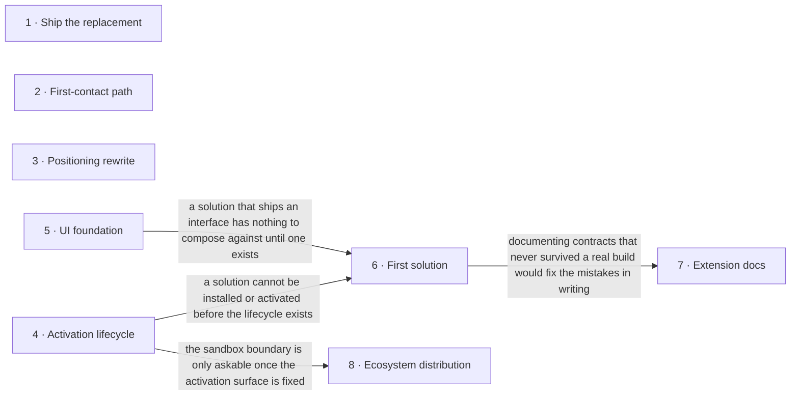

# Roadmap — fapost-core

> **A decomposition, not a promise.** The overall idea broken into incremental steps: what each
> step is, where it comes from, how big it is — or that nobody has looked at it yet — and in which
> order, and parallel lanes, we walk them. **No dates** (except shipped history), **no scores** —
> order is the prioritization. The *solution* for any step is designed in the task that takes it on,
> not here.

> **Scope split.** This file is the product decomposition of [`idea-brief.md`](./idea-brief.md).
> Engineering milestones, their history and their checkbox detail stay in
> [`platform/ROADMAP.md`](./platform/ROADMAP.md) and [`platform/TASKS.md`](./platform/TASKS.md);
> nothing here restates them. Zones below are verified against
> [`ARCHITECTURE.md`](../.ai/knowledge/ARCHITECTURE.md).

## Destination

A developer inside the Laravel ecosystem can stand up FaPost, extend it through the public contracts without the author's help, and deliver a client's conversational assistant faster than on the system FaPost replaces.

## Steps

| # | Step | Source | Size | Status |
|---|---|---|:---:|---|
| 1 | Ship the replacement — close the remaining production-readiness criteria, including the concurrency suite that today runs against mocks only, and put the platform under real client rollouts | idea-brief.md §4 Why now | M | idea |
| 2 | First-contact path — installation, a seeded demo assistant and self-hosting docs, with a named target time from install to a working assistant | idea-brief.md §6 Risks | M | idea |
| 3 | Positioning rewrite — project description and landing rebuilt on the three pillars, so the difference reads to someone who already uses an open constructor | idea-brief.md §7 Recommendation | S | idea |
| 4 | Solution activation lifecycle — manifest validation, activation storage and registry, the activation screen, and the lifecycle tests that prove install → activate → handler available | idea-brief.md §7 Recommendation | M | idea |
| 5 | UI foundation for extenders — one token source shared by the operator-facing surfaces and the small set of primitives an extension actually composes against | idea-brief.md §6 Risks | M | idea |
| 6 | First solution built through the public contracts only — no privileged access into the core, as an outsider would build it | idea-brief.md §7 Recommendation | L | idea |
| 7 | Extension documentation for outsiders — the Extending section rewritten against contracts that survived a real build | idea-brief.md §3 Users | M | idea |
| 8 | Ecosystem distribution → see [Not yet specified](#not-yet-specified) | idea-brief.md §7 Recommendation | fog | idea |

## Not yet specified

| Area | What we'd have to learn | Blocks | How it gets sharpened |
|---|---|:---:|---|
| Ecosystem distribution — how a third-party extension reaches another installation and what it is allowed to do once there | What an extension may do at runtime, where the sandbox boundary sits, whether distribution rides on the existing package channel or needs its own, and what a paid closed extension needs in order to be installable at all | 8 | A recon pass once the first solution has been built through the public contracts, since that build is what reveals which contracts an outsider actually touches |

## Out of scope

- **Staff activity log** — no section of the brief justifies it; its stated purpose is selling to tenants with several staff, and earning money is explicitly not this stage's goal. Detail stays in [`platform/ROADMAP.md`](./platform/ROADMAP.md).
- **Model-integration server surface** — no section of the brief justifies it; it closes none of the three positioning pillars. Detail stays in [`platform/ROADMAP.md`](./platform/ROADMAP.md).
- **Web forms data collection** — a product feature with no anchor in the brief; it neither tests extensibility nor shortens the first-contact path. Detail stays in [`platform/ROADMAP.md`](./platform/ROADMAP.md).
- **Multi-tenant shell and billing** — the owner's separate closed product, not part of the open distribution (idea-brief.md §5 Out of scope).
- **Additional messenger channels** — channel swappability is architectural, but no further channel is promised to a date; they follow demand (idea-brief.md §5 Out of scope).
- **Monetising the core** — not a goal of this stage; the goal is core quality and ease of extension (idea-brief.md §5 Out of scope).

## Open decisions

| # | Question | Type | Owner | Blocks |
|---|---|:---:|:---:|:---:|
| D1 | Which of the three pillars — permissive licence, conversation as a first-class object, native stack — carries the first sentence of the project description and the landing page | grilling | human | 3 |
| D2 | What is the target time from a fresh installation to a first working assistant, as a number we are willing to be measured against | grilling | human | 2 |
| D3 | How does "not earning money right now" reconcile with a shell, billing and a marketplace remaining in the plans — which of the two signals leads | grilling | human | 8 |
| D4 | Does an installed solution have to be rebuilt into the front-end bundle before its overrides appear, and is there a path that avoids it | research | agent | 4 |
| D5 | Does the public site keep its own brand palette, or does one token source cover every surface including it | grilling | human | 5 |

## Decisions so far

- The product decomposition lives here; engineering milestones and their history stay separate → [`platform/ROADMAP.md`](./platform/ROADMAP.md)
- Positioning is a framework for developers in the Laravel ecosystem, built on three pillars, not another open bot constructor → [`idea-brief.md §7 Recommendation`](./idea-brief.md)
- Multi-tenancy is closed automatically by the bounded context; the open distribution installs single-tenant and the multi-tenant shell stays a separate closed product → [`idea-brief.md §5 Out of scope`](./idea-brief.md)
- The extension contracts live in their own repositories, absent from this working tree and symlinked in for local development → [`ARCHITECTURE.md`](../.ai/knowledge/ARCHITECTURE.md)
- The extension surface is partly built already: the action handler registry and the builder component publish contract exist, activation and manifest validation do not → [`ARCHITECTURE.md`](../.ai/knowledge/ARCHITECTURE.md)
- The bet is tested on the owner's own client rollouts carried out through the public contracts, not on a showcase for buyers → [`idea-brief.md §7 Recommendation`](./idea-brief.md)

## Dependency graph

## Execution path

| Wave | Steps | Zone per step (why parallel-safe) | Unlocks |
|:---:|---|---|---|
| 1 | 1 ∥ 2 ∥ 3 | 1: `tests/` · 2: `docs/site/self-hosting/` · 3: `README.md` (disjoint) | — |
| 2 | 4 ∥ 5 | 4: `app/Domains/Tenancy` + `app/Filament` · 5: `resources/css` + `resources/js/shared` (disjoint) | 6 |
| 3 | 6 | 6: `(new)` solution package repository | 7 |
| 4 | 7 | 7: `docs/site/extending/` | — |

Contract edits that step 4 or step 6 turn out to need happen in the foundation package's own repository, which is `(new)` ground from this working tree's point of view — it is absent here and symlinked in for local development, so it can never conflict with a lane in this repo.

## Shipped

| Step | Shipped | Link |
|---|---|---|
