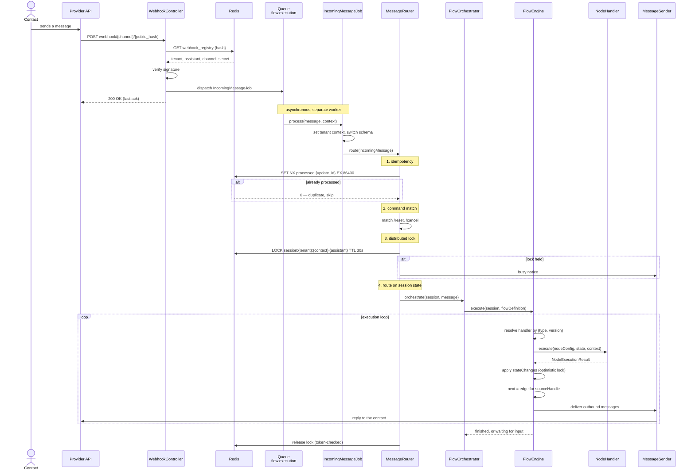

## The path of an incoming message

## Tenancy

Tenant context is a runtime coordinate, not an option.

- Tenant context is mandatory; runtime code fails fast without it
- There is one runtime model, with no deployment mode to branch on
- Context switching is encapsulated by the Tenancy domain
- User data lives in tenant schemas

See [Tenant-aware execution](/contributing/tenant-aware-execution).

## Flow engine

- A flow is stored as a JSON graph
- The execution loop is deterministic
- Handlers resolve by `(type, version)`
- Registries are built at boot, with no database lookup on the hot path

A handler is graph-unaware: it returns a `sourceHandle`, and the engine resolves
the next node from the flow's edges. See
[Handler contract](/extending/flow-nodes/handler-contract).

## Concurrency

Incoming message processing has three protection layers, and they guard different
failures:

| Layer | Guards against |
|---|---|
| Redis idempotency key | The provider delivering the same update twice |
| Distributed lock on the session | Two messages from one contact racing each other |
| Optimistic lock on `flow_sessions.version` | A concurrent write landing between read and update |

A lock that cannot be acquired produces a **busy notice**, not a dropped message —
the job goes to a backoff queue.

## Webhook routing

The URL is `/webhook/{channel}/{public_hash}`, and `public_hash` resolves through
Redis.

<Warning>
  The landlord database must not participate in a routing hot path. Resolution is
  a Redis lookup precisely so that inbound traffic never waits on platform-level
  storage.
</Warning>

Inbound messages are handed to `IncomingMessageJob` and resolved through the
tenant-aware routing pipeline.

## Queues

Queues are separated by purpose, not by convenience — see
[Queues](/reference/queues) for the full list and the reasoning.

## Ingress

Webhook ingress is served by PHP-FPM, or — when volume justifies it — by the Go
[webhook gateway](/self-hosting/gateway) in front of it. Core runs no long-lived
PHP request runtime.

Queue workers, however, are long-lived: one Horizon process handles many jobs. See
[Long-lived worker safety](/contributing/worker-safety) for what that forbids.
